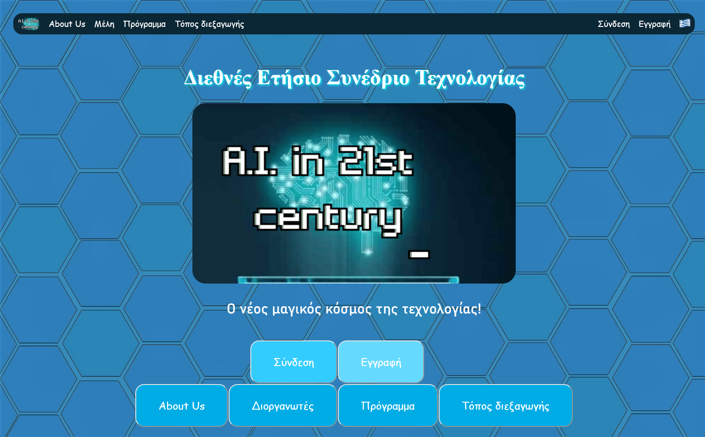
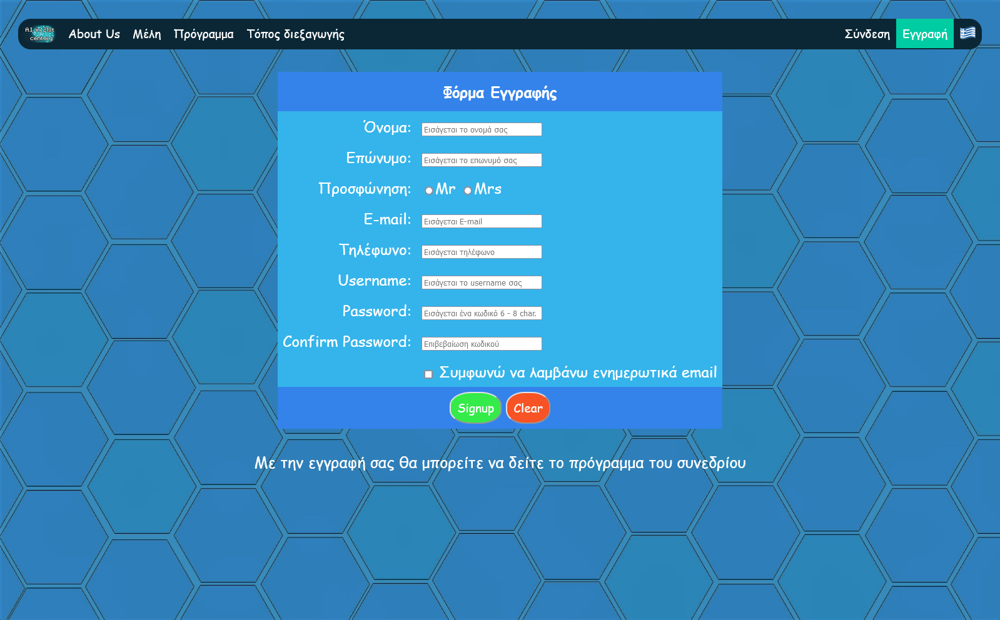
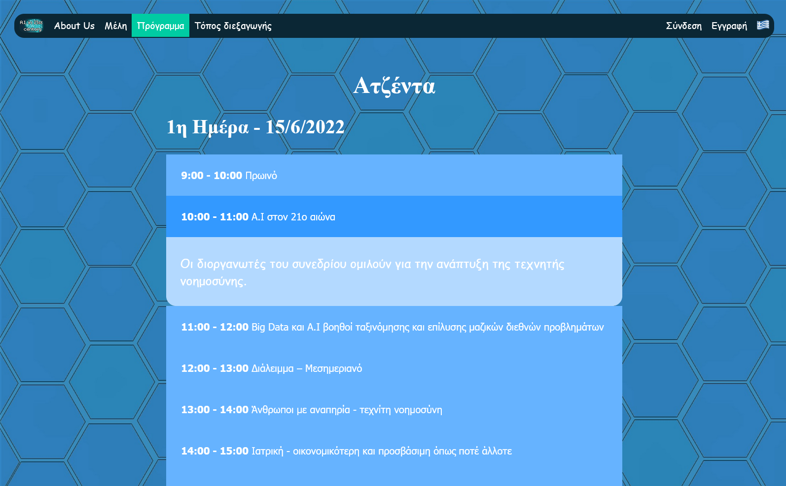

# Internet Technologies (2020) - Scientific Conference Website

## Project Overview

This project is a web-based application developed for the final assignment of the "Internet Technologies" course, offered in the 1st semester of the 2020 academic year at the University of Piraeus, Department of Informatics. The goal was to create a fully functional website for a scientific conference. The website includes a variety of pages, such as a homepage, information about the conference, a tourist guide, a registration form, and a login system. The project emphasizes user interactivity, proper form validation, database integration, and responsive design, making it a comprehensive example of a real-world web application.

## Course Information
- **Institution:** [University of Piraeus](https://www.unipi.gr/en/)
- **Department:** [Department of Informatics](https://cs.unipi.gr/en/)
- **Course:** Internet Technologies (2020)
- **Semester:** 1st

## Technologies Used

- **Frontend:** HTML, CSS, JavaScript
- **Backend:** PHP
- **Database:** MySQL

## Usage Examples
### Homepage

The homepage features a dynamic menu that allows navigation between different sections of the website. Hovering over a specific image on the homepage causes a zoom-in effect, enhancing the user experience.

### Registration Form

The registration page includes a form with validation checks to ensure accurate user input.

### Conference Schedule Access

Users can view the conference schedule only after logging in. Unauthenticated users attempting to access the schedule are redirected to the login page if no session exists.

## Setup Instructions

1. Import the provided SQL file (users.sql) into your MySQL server.
2. Update the database connection settings in the code with your database credentials.
3. Ensure you have a local server set up (e.g., XAMPP, WAMP, MAMP).
4. Place the project files in the server's root directory (e.g., htdocs for XAMPP).
5. Open a web browser and navigate to http://localhost.

## License

This project is licensed under the MIT License - see the [LICENSE](./LICENSE) file for details.

## Known Issues

- Session Management: Session handling is not fully set up, which may affect user authentication and access control.
